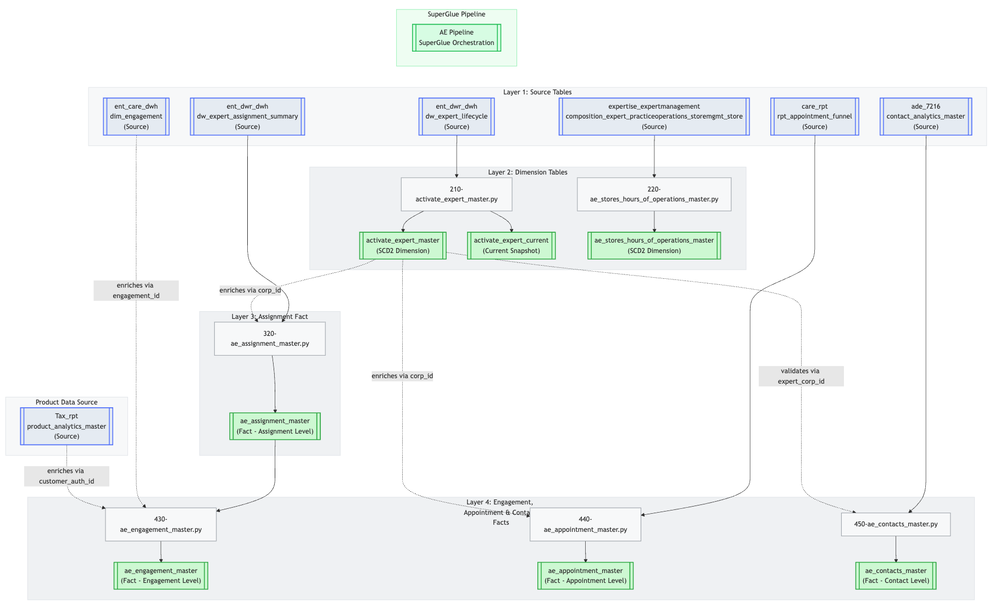
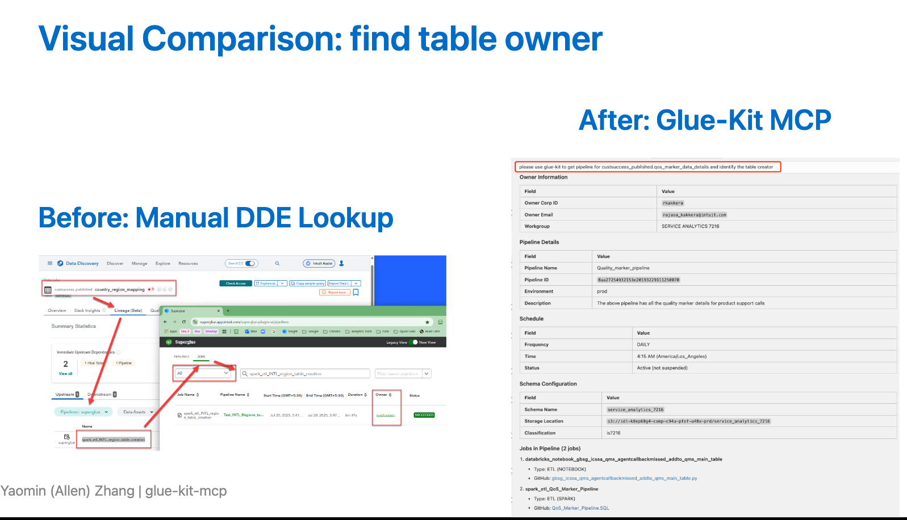
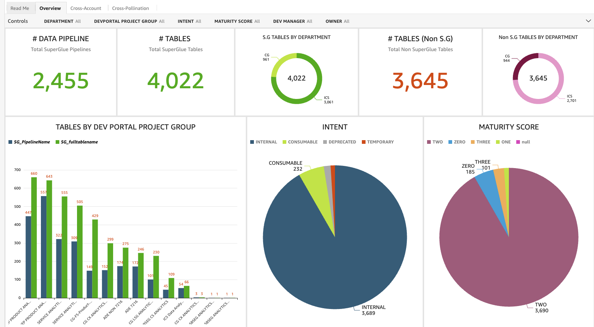
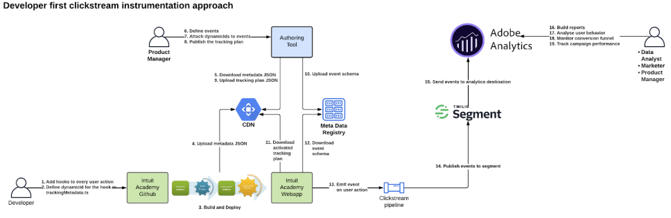
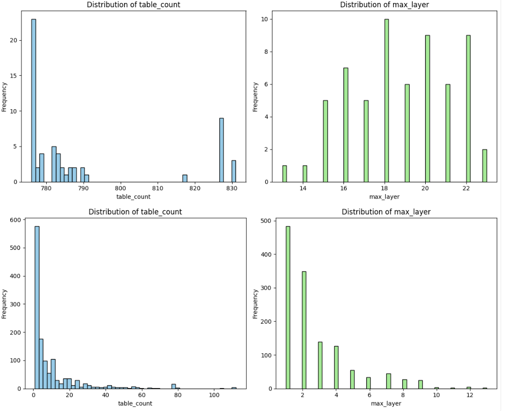
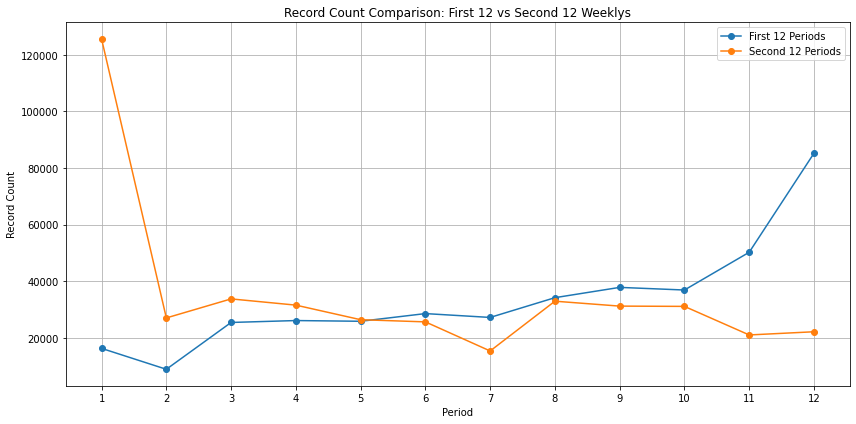

# Intuit Projects

**Period**: August 2024 – December 2025  
**Role**: Data Engineer (Consultant via Altrimetik)  
**Organization**: ICS (Intuit Customer Success)

---

## Project Categories

| Category | Description |
|----------|-------------|
| **Research** | Investigation, analysis, planning work |
| **Development** | Tool and pipeline development |
| **Execution** | Implementation and operational work |

---

## Project Timeline

### 2025-12: Activate Experts Data Pipeline

**Category**: Development  
**Context**: Activate Experts (AE) has a **$250M** goal. AE is a key driver of the Assisted services input goal. Activate Experts markets FS Experts and offerings in local keyword search ("Taxes near me") across a variety of digital and physical channels (Google maps listings, paid search, digital media, mail, billboards, etc.). Local search is enabled by our planned retail footprint of 500 physical locations. Building data pipelines for the Activate Experts initiative to support expert-customer matching and engagement analytics. This involves designing fact tables for assignment, engagement, and appointment data across the tax expert ecosystem.  
**Outcome**: Production-ready data pipelines powering Activate Experts dashboards and reporting.

---

### 2025-11: glue-kit-mcp

**Category**: Development  
**Context**: Created an MCP server to bring SuperGlue pipeline management and data lineage capabilities into AI assistant environments like Cursor and Claude Desktop. Enables natural language queries for pipeline dependencies and GitHub repository discovery.  
**Outcome**: Developer productivity tool automating migration workflows and pipeline analysis.

Architecture:

Comparison between glue-kit-mcp and other tools:

---

### 2025-10: Optimize SG10 to SG20 Workflow

**Category**: Research  
**Context**: Research initiative to optimize the data migration workflow from SuperGlue 1.0 to SuperGlue 2.0. Analyzed bottlenecks in the existing migration process and identified automation opportunities.  
**Outcome**: Streamlined workflow reducing manual effort in migration tasks.

---

### 2025-09: 1st Round Data Migration

**Category**: Execution  
**Context**: Executed the first major wave of data migration from SG10 to SG20 to meet the October 1st deadline. Coordinated with multiple teams to ensure data integrity and minimal disruption to downstream consumers.  
**Outcome**: Successfully migrated critical data assets on schedule.

---

### 2025-08: Data Migration Plan

**Category**: Research  
**Context**: Comprehensive planning for migrating ICS data from SuperGlue 1.0 to SuperGlue 2.0. Assessed over 4,000 tables, mapped dependencies, and developed prioritization criteria based on business criticality.  
**Outcome**: Detailed migration roadmap with phased execution timeline.

---

### 2025-07: Data Governance Analysis

**Category**: Research  
**Context**: Analyzed the data governance status across ICS data assets. Created an inventory dashboard to help the team understand data ownership, classification, and compliance status of their data assets.  
**Outcome**: ICS data asset inventory dashboard providing visibility into governance status.

---

### 2025-06: Decommission EMR Cluster

**Category**: Execution  
**Context**: Led a cost optimization initiative to decommission underutilized EMR clusters. Analyzed usage patterns and coordinated workload migration to more efficient compute resources.  
**Outcome**: Reduced cloud infrastructure costs through resource optimization.

---

### 2025-05: Intuit Academy Data Pipeline

**Category**: Development  
**Context**: Developed data pipelines for Intuit Academy. Built ETL processes to aggregate and transform learning and certification data for analytics reporting. Performed data reverse engineering to understand the data and business logic. Helped the team add the missing campaign attribute to the data.  
**Outcome**: Data pipeline enabling variance analysis and performance tracking for Intuit Academy.

---

### 2025-04: Third Party Data Integration

**Category**: Development  
**Context**: Integrated third-party data sources for SalesTech to enhance sales analytics capabilities. Designed ingestion pipelines and data quality checks for external vendor data.  
**Outcome**: Enriched sales analytics with third-party data integration.

---

### 2025-03: Data Stewardship Democratization

**Category**: Research  
**Context**: Analyzed data stewardship processes and planned democratization to onboard new data stewards for ADE, Service Analytics, and VEPPA teams. Documented best practices and created onboarding materials.  
**Outcome**: Playbook for onboarding new data stewards across multiple teams.

---

### 2025-02: S3 Bucket Policy Compression

**Category**: Research  
**Context**: Investigated S3 bucket policy hitting the 20KB limit, causing new table access requests to fail. Tested cleanup of inactive roles that have not accessed the bucket — big effort needed and also not very effective in reducing the policy size. But our effort contributed to a solution to compress and optimize bucket policies.  
**Outcome**: Policy compression playbook resolving the 20KB limit constraint.

---

### 2025-01: SG10 Lineage Complexity Analysis

**Category**: Research  
**Context**: Analyzed data lineage complexity across ICS pipelines to plan the transition to SuperGlue 2.0. Identified high-complexity tables requiring special migration handling.  
**Outcome**: Transition planning documentation and tracking SG20 known-issues.

---

### 2024-12: Democratize DevPortal Management

**Category**: Research  
**Context**: Investigated DevPortal management processes to enable self-service capabilities for data teams. Documented procedures and created automation scripts for common tasks.  
**Outcome**: DevPortal management playbook enabling team self-service.

---

### 2024-11: Knowledge Sharing Sessions

**Category**: Execution  
**Context**: Hosted knowledge sharing sessions to introduce Data Disentangler and data profiling tools to the ICS data team. Provided hands-on demonstrations and documentation.  
**Outcome**: Team adoption of new data exploration and profiling capabilities.

---

### 2024-10: Data Lineage Tool

**Category**: Development  
**Context**: Contributed to the Data Disentangler tool for exploring and analyzing data lineage relationships in Intuit's data ecosystem. This tool was built on top of MDR pipeline metadata table, but it creatively remodeled the data structure and the UI to make it more user-friendly and intuitive. Analyzed data lineage complexity across ICS pipelines to plan the transition to SuperGlue 2.0.  
**Outcome**: Data lineage exploration tool for impact assessment and dependency tracking.

**Downstream Impact Analysis**: The tool enables rapid identification of all downstream consumers affected by upstream table changes. This capability significantly reduced the time needed for impact assessment from hours to minutes, making data migrations and schema changes safer and more predictable.

---

### 2024-09: Data Profiling Tool

**Category**: Development  
**Context**: Created a data profiling tool to automate data quality assessment and statistical analysis of datasets. Designed to support data exploration workflows.  
**Outcome**: Automated data profiling capabilities for the data team. Streamlined the parity check process for UAT testing.

---

### 2024-08: ICS AWS Account Investigation

**Category**: Research  
**Context**: Surveyed the landscape of AWS services and resources used by ICS. Evaluated technical debt, security posture, and potential risks across the account infrastructure. There are at least 5 years of technical debt. And the monolithic datalake pool of custsuccess_published/custsuccess_sandbox is not efficient, and it also arose a lot of data governance issues.  
**Outcome**: AWS infrastructure blueprint documenting current state and improvement recommendations. This blueprint also helped ICS team get a broad sense about how capabilities and systems are connected.

---

## Summary

From **August 2024** to **December 2025**, completed:

- **9 Research** projects
- **7 Development** projects  
- **3 Execution** projects

